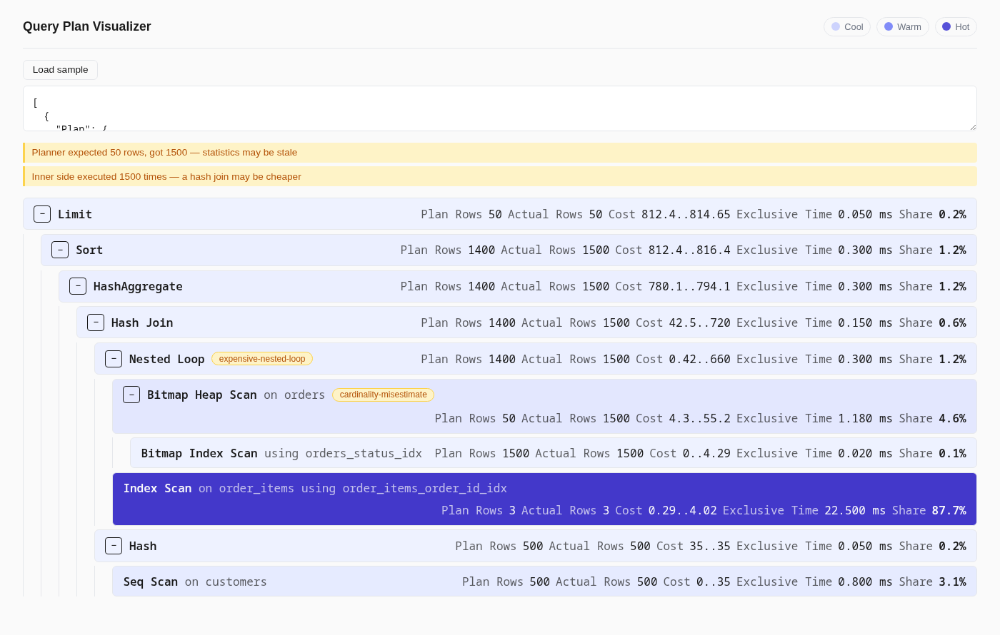

# Query Plan Visualizer

**Live: [query-plan-visualizer-one.vercel.app](https://query-plan-visualizer-one.vercel.app)**

Paste a PostgreSQL `EXPLAIN (ANALYZE, FORMAT JSON)` plan and get an interactive, heat-mapped execution tree that shows where the time actually went.



## Try it

Paste this into the input (or just click "Load sample" on the live site):

```json
[
  {
    "Plan": {
      "Node Type": "Limit",
      "Startup Cost": 812.4,
      "Total Cost": 814.65,
      "Plan Rows": 50,
      "Plan Width": 96,
      "Actual Startup Time": 25.61,
      "Actual Total Time": 25.65,
      "Actual Rows": 50,
      "Actual Loops": 1,
      "Plans": [
        {
          "Node Type": "Sort",
          "Parent Relationship": "Outer",
          "Sort Method": "quicksort",
          "Startup Cost": 812.4,
          "Total Cost": 816.4,
          "Plan Rows": 1400,
          "Plan Width": 96,
          "Actual Startup Time": 25.6,
          "Actual Total Time": 25.6,
          "Actual Rows": 1500,
          "Actual Loops": 1,
          "Plans": [
            {
              "Node Type": "HashAggregate",
              "Parent Relationship": "Outer",
              "Startup Cost": 780.1,
              "Total Cost": 794.1,
              "Plan Rows": 1400,
              "Plan Width": 96,
              "Actual Startup Time": 25.3,
              "Actual Total Time": 25.3,
              "Actual Rows": 1500,
              "Actual Loops": 1,
              "Plans": [
                {
                  "Node Type": "Hash Join",
                  "Parent Relationship": "Outer",
                  "Startup Cost": 42.5,
                  "Total Cost": 720.0,
                  "Plan Rows": 1400,
                  "Plan Width": 88,
                  "Actual Startup Time": 0.09,
                  "Actual Total Time": 25.0,
                  "Actual Rows": 1500,
                  "Actual Loops": 1,
                  "Plans": [
                    {
                      "Node Type": "Nested Loop",
                      "Parent Relationship": "Outer",
                      "Startup Cost": 0.42,
                      "Total Cost": 660.0,
                      "Plan Rows": 1400,
                      "Plan Width": 60,
                      "Actual Startup Time": 0.06,
                      "Actual Total Time": 24.0,
                      "Actual Rows": 1500,
                      "Actual Loops": 1,
                      "Plans": [
                        {
                          "Node Type": "Bitmap Heap Scan",
                          "Parent Relationship": "Outer",
                          "Relation Name": "orders",
                          "Filter": "(status = 'shipped'::text)",
                          "Startup Cost": 4.3,
                          "Total Cost": 55.2,
                          "Plan Rows": 50,
                          "Plan Width": 40,
                          "Actual Startup Time": 0.05,
                          "Actual Total Time": 1.2,
                          "Actual Rows": 1500,
                          "Actual Loops": 1,
                          "Plans": [
                            {
                              "Node Type": "Bitmap Index Scan",
                              "Parent Relationship": "Outer",
                              "Index Name": "orders_status_idx",
                              "Startup Cost": 0,
                              "Total Cost": 4.29,
                              "Plan Rows": 1500,
                              "Plan Width": 0,
                              "Actual Startup Time": 0.02,
                              "Actual Total Time": 0.02,
                              "Actual Rows": 1500,
                              "Actual Loops": 1
                            }
                          ]
                        },
                        {
                          "Node Type": "Index Scan",
                          "Parent Relationship": "Inner",
                          "Relation Name": "order_items",
                          "Index Name": "order_items_order_id_idx",
                          "Startup Cost": 0.29,
                          "Total Cost": 4.02,
                          "Plan Rows": 3,
                          "Plan Width": 20,
                          "Actual Startup Time": 0.01,
                          "Actual Total Time": 0.015,
                          "Actual Rows": 3,
                          "Actual Loops": 1500
                        }
                      ]
                    },
                    {
                      "Node Type": "Hash",
                      "Parent Relationship": "Inner",
                      "Startup Cost": 35.0,
                      "Total Cost": 35.0,
                      "Plan Rows": 500,
                      "Plan Width": 28,
                      "Actual Startup Time": 0.85,
                      "Actual Total Time": 0.85,
                      "Actual Rows": 500,
                      "Actual Loops": 1,
                      "Plans": [
                        {
                          "Node Type": "Seq Scan",
                          "Parent Relationship": "Outer",
                          "Relation Name": "customers",
                          "Startup Cost": 0,
                          "Total Cost": 35.0,
                          "Plan Rows": 500,
                          "Plan Width": 28,
                          "Actual Startup Time": 0.01,
                          "Actual Total Time": 0.8,
                          "Actual Rows": 500,
                          "Actual Loops": 1
                        }
                      ]
                    }
                  ]
                }
              ]
            }
          ]
        }
      ]
    },
    "Planning Time": 0.31,
    "Execution Time": 25.72
  }
]
```

This plan flags two warnings out of the box: a stale cardinality estimate on `orders` (planner expected 50 rows, got 1500) and a nested loop whose inner side — `order_items` — gets rescanned 1500 times.

## Why

I spent 2.7 years reading execution plans by hand at a bank. Every one of them started the same way: paste the plan into a text editor, manually walk the tree, do the inclusive-time-minus-children arithmetic in my head to figure out which node was actually slow, because the number Postgres prints on the root node is the total runtime, not the culprit. This is the tool I wanted for that — something that does the exclusive-time math for you and puts the color where the problem is, instead of making you re-derive it every single time.

## Scope

**In:** paste `EXPLAIN (ANALYZE, FORMAT JSON)` output, get a collapsible tree with per-node timing, a heat map by exclusive time, and warnings for sequential scans, cardinality misestimates, expensive nested loops, and disk-spilling sorts.

**Deliberately out:**
- **Text-format `EXPLAIN` parsing** — JSON is already structured; text is an hour of regex for zero extra signal.
- **Plan sharing / persistence / URLs** — no backend, no database, nothing to persist to.
- **Multi-plan diffing** — a real feature, but a different tool than "read one plan fast."
- **Oracle or MySQL plan formats** — different shapes, different timing semantics; not worth blurring the one format this tool understands well.

## Possible extensions

- **Memoize hit-ratio refinement.** Today the expensive-nested-loop warning is suppressed for any `Memoize` inner side, on the assumption that caching fixes the rescan cost. A fuller version would read `Cache Hits` vs. `Cache Misses`/evictions on the `Memoize` node and still warn when the cache is thrashing — a low hit ratio means the loop is still expensive, it's just wearing a cache in front of it.

## Stack

React + TypeScript + Vite, deployed on Vercel. No backend, no database, no network calls — everything runs client-side in the browser.

```bash
npm install
npm run dev      # local dev server
npm run build    # production build
npm test         # vitest
```
